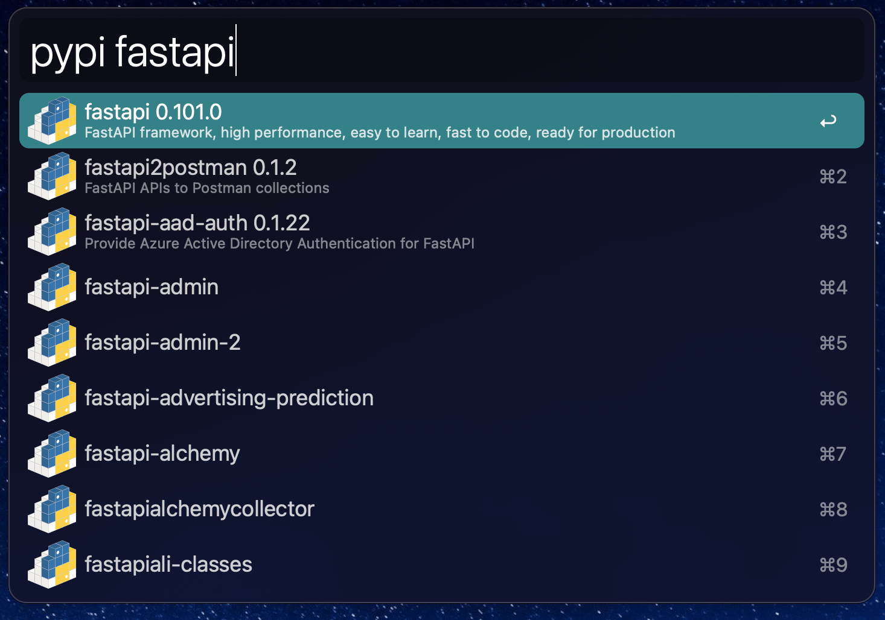

# pypied

An alfred workflow to search for python packages in pypi and get the latest version number of a package.

## Requires

- Python 3
- Alfred Powerpack

## Installation

Download workflow [here](https://github.com/saeedesmaili/alfred-pypied/blob/master/pypied.alfredworkflow)

## Usage

### Fetch the list of packages

Since pypi doesn't provide an api to search for packages and it [recommends](https://peps.python.org/pep-0691/) to use `https://pypi.org/simple/` instead, this workflow fetches the list of python packages when it's used for the first time (~22MB will be downloaded). This list gets stored as a json file in workflow's directory and will be used to search for packages. To update this list you can use `pypi-fetch` keyword.

### Search for packages

Use `pypi <package-name>` keyword (as shown in the demo above).

First three results will have an up-to-date `latest version` and `summary` (fetched from pypi in real time). Other items in the list will only have the `name` (fetched from the local json file to prevend rate limit on pypi).

### Copy the latest version to clipboard

Hitting `enter` will copy the latest version number of the package to clipboard (`0.101.0` in the demo above).

### Open the package page on pypi

Holding `Option` while hitting `Enter` will open the package's page on pypi in the default browser.

### view list of the latest versions of a package

Use `pypi <package-name>/` to view a list of the latest versions of a package:

Hitting `enter` in this list will copy the version number to the clipboard.

## TODO & Contribution

This is my first attempt to create an alfred workflow. Let me know in the issues of this repo if you have any solutions for the following TODO items, or if you can help with improving this workflow.

- [ ] Display a `fetching packages ...` message when `pypi-fetch` keywords is used and the list is being downloaded.
- [ ] Get the details of all packages in the search results in an efficient way (without requiring user to wait for the all requests to be finished and without rate limiting on pypi).
- [ ] Display other details of the package (repo url, documentation url, etc).
